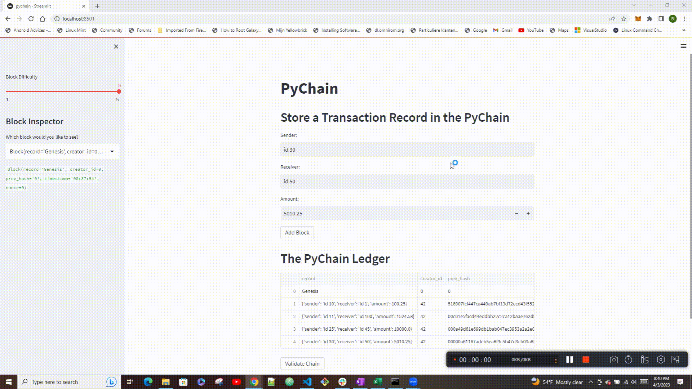

# Blockchanin-based Ledger System

### Blockchain-based ledger system, is equiped with a user-friendly web interface. The ledger allows participants to conduct financial transactions (to transfer money between senders and receivers) and to verify the integrity of the data in the ledger. Furthermore, the blockchain is supported by the Proof of Work (PoW) Concensus protocol with an inbuilt user-friendly functionality to adjust the difficulty level of the protocol. Finally, owing to the blockchain transparency, the users can easily verify the block contents and hashes via a drop-down menu and validate the whole blockcahin with one click of a button.

---


---

## Table of contents

1. [Technologies](#technologies)
2. [Installation Guide](#installation-guide)
3. [Usage](#usage)
4. [Contributors](#contributors)
5. [License](#license)

---

## Technologies

`Python 3.9`

_Libraries_

1. `Pandas` is a Python package that provides fast, flexible, and expressive data structures designed to make working with large sets of data easy and intuitive.

   - [pandas](https://github.com/pandas-dev/pandas) - for the documentation, installation guide and dependencies.

2. `Streamlit` is a library that allows developers to build web applications with live user input.

   - [Streamlit](https://streamlit.io/) - to read more about deploying, installing and customizing.<br/>

---

## Installation Guide

The application must be started from the terminal using Streamlit, once in the directory of the application:<br/>

```python
streamlit run pychain.py
```

### Library Installations

Before using the application first install the following dependencies by using your terminal:

> Option 1 - Intsall needed libraries with requirements.txt file included in the reporsitory. For this option:<br/>

- install [pipreqs](https://pypi.org/project/pipreqs/):

  ```python
  pip install pipreqs
  ```

- Install all libraries that we have in requirements.txt::

  ```python
  pip install -r requirements.txt:
  ```

> Option 2 - Install each library individually:<br/>

To install pandas run:

```python
pip install pandas
```

```python
# or conda
conda install pandas
```

To install Streamlit, in Terminal run:

```python
pip install streamlit
```

Confirm the installation of the Streamlit package by running the following commands in Terminal:

```python
 conda list streamlit
```

---

## Usage

> Application summary<br/>

- Block creation and addition to the ledger:<br/>
  The Blockchanin-based Ledger System provides the blockchain participants with an easy and user-friendly way to store transaction records on the blockchain. After a sender, a receiver and a transaction amount information are given, the block containing the transaction data will be added to the ledger once the hash value based on the required difficulty level (NOTE: the difficulty level can be adjusted by the user via a slider on the sidebar of the application) is generated by the miners.<br/>
  The user can see when a block is added via The PyChain Ledger view on the application:<br/>
  

- Verification of the block contents and hashes and blockchain validation :<br/>

  Users can verify the content of the block and the hash values at any point in time via the Block-Inspector drop-down menu located on the sidebar of the application.<br/>
  The whole blockchain can also be validated as each block contains the hash value of the previous block (thereby creating a "chain" linking the blocks). The validation can be performed by clicking on the Validate Chain button located in the main body of the application. <span style="color:lightgreen">**True**</span> response will confirm the validity of the blockchain:<br/>
  

> Getting started<br/>

- To use Blockchanin-Based Ledger System first clone the repository to your PC.<br/>
- Use `streamlit run pychain.py` as per the instructions in the [Installation Guide](#installation-guide) to run the application.<br/>

---

## Contributors

Contact Details:

Boris Dudkin:

- [Email](boris.dudkin@gmail.com)
- [LinkedIn](www.linkedin.com/in/Boris-Dudkin)

---

## License

MIT

---
